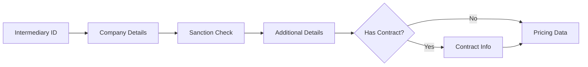

# 🚀 Bond Quotation Agent

A production-ready Angular application featuring a Gen-AI powered "Quote Specialist" virtual agent bot that facilitates intermediaries in creating bond quotations through an interactive chat-first UI.

## ✨ Features

- **🤖 AI-Powered Chat Interface** - Natural language processing for bond quotation requests
- **🔐 Intermediary Validation** - Secure access control for registered intermediaries
- **📊 Real-time Quote Builder** - Sticky side panel that updates as you chat
- **🏢 Company Profile** - Comprehensive company details collection with address validation
- **🏆 Grade-Based Access Control** - RAG pricing gated by company credit ratings (A, B, C only)
- **🔒 Automated Sanction Checks** - Early compliance validation with grade display
- **📝 Contract Management** - Optional existing contract details integration
- **💾 Smart State Management** - Angular Signals for reactive quote updates
- **🎨 Modern Material 3 UI** - Light/dark theme support with beautiful components
- **📱 Responsive Design** - Works seamlessly on desktop and mobile devices

## 🏗️ Architecture

### Monorepo Structure
```
bond-quotation-agent/
├── apps/
│   └── web/                 # Angular 17 frontend application
├── packages/
│   ├── api/                 # Express.js backend API
│   └── shared/              # Shared schemas and utilities
```

### Technology Stack
- **Frontend**: Angular 17 (standalone components, Signals, Material 3)
- **Backend**: Express.js with TypeScript
- **Package Manager**: pnpm workspaces
- **Schema Validation**: Zod
- **Testing**: Playwright for E2E testing
- **Build Tool**: Angular CLI

## 🚀 Quick Start

### Prerequisites
- Node.js 18+ 
- pnpm 8+

### Installation
```bash
# Clone the repository
git clone https://github.com/nirmal-h/bond-quotation-agent.git
cd bond-quotation-agent

# Install dependencies
pnpm install

# Start both frontend and backend
pnpm dev
```

### Access the Application
- **Frontend**: http://localhost:4200
- **Backend API**: http://localhost:3001

## �� How to Use

### 1. Intermediary Validation
```
INT-100
```
The agent will validate your intermediary registration.

### 2. Company Details
```
Company ID: C-001
Company Address: 123 Business Street, New York, NY
Business Unit: Finance Department
```
The agent will fetch your company grade and run an immediate sanction check.

### 3. Additional Details
```
Debt Type Code: DT001
Deposition Country: United States
Duration: 6 months (or 180 days)
```
The agent will collect essential bond parameters.

### 4. Contract Information (if applicable)
```
Do you have an existing contract? yes
Contract Number: CNT001
Subcontract Number: SUB001
Limit Number: LMT001
```
Optional contract details if you have an existing agreement.

### 5. View Pricing
The agent will display pricing data based on your company grade and parameters.

## 🔄 Complete Workflow



Key Steps:
1. **Intermediary Validation** - Verify registered intermediary
2. **Company Details** - ID, Address, Business Unit
3. **Sanction & Grade** - Immediate compliance check
4. **Additional Details** - Debt type, country, duration
5. **Contract Info** - Optional existing contract details
6. **Pricing Display** - Final rate calculation

## 🎯 Supported Bond Types

- **Performance Bonds** - Most common, covers contract completion
- **Advance Payment Bonds** - Secures advance payments
- **Bid Bonds** - Guarantees bid submission
- **Custom Bonds** - Specialized requirements

## 🌍 Supported Countries

US, UK, Canada, Australia, Germany, France, Japan, China, India, Brazil

## 🔐 Access Control

- **Grades A, B, C**: Full RAG pricing access
- **Grades D, E**: Manual review required (RAG blocked)

## 🧪 Testing

### E2E Tests
```bash
cd apps/web
pnpm e2e
```

### Build Tests
```bash
# Test frontend build
cd apps/web && pnpm build

# Test backend build  
cd packages/api && pnpm build
```

## 📁 Project Structure

```
src/
├── app/
│   ├── core/
│   │   ├── services/        # Agent, API, and business logic
│   │   └── state/           # Quote store with Angular Signals
│   ├── pages/
│   │   └── chat/            # Main chat interface
│   └── shared/
│       └── components/      # Reusable UI components
```

## 🔧 Development

### Adding New Features
1. **Frontend**: Add components in `apps/web/src/app/shared/components/`
2. **Backend**: Add routes in `packages/api/src/routes/`
3. **Schemas**: Update `packages/shared/src/schemas/`

### Code Style
- TypeScript strict mode enabled
- Angular standalone components
- Material 3 design system
- Reactive programming with Signals

## 🚀 Deployment

### Frontend
```bash
cd apps/web
pnpm build
# Deploy dist/ folder to your hosting service
```

### Backend
```bash
cd packages/api
pnpm build
# Deploy to your Node.js hosting service
```

## 🤝 Contributing

1. Fork the repository
2. Create a feature branch (`git checkout -b feature/amazing-feature`)
3. Commit your changes (`git commit -m 'Add amazing feature'`)
4. Push to the branch (`git push origin feature/amazing-feature`)
5. Open a Pull Request

## 📄 License

This project is licensed under the MIT License - see the [LICENSE](LICENSE) file for details.

## 🆘 Support

For support and questions:
- Create an issue in this repository
- Check the documentation in the `/docs` folder
- Review the API endpoints in `/packages/api/src/routes/`

## 🔮 Roadmap

- [ ] Multi-language support
- [ ] Advanced RAG with vector databases
- [ ] Real-time collaboration features
- [ ] Mobile app (React Native)
- [ ] Integration with external bond systems
- [ ] Advanced analytics and reporting

---

**Built with ❤️ using Angular 17, Express.js, and modern web technologies** 